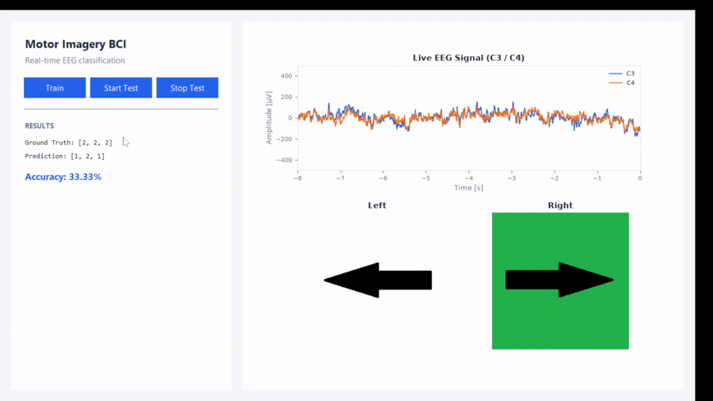

# EEG Motor Imagery BCI

A real-time brain-computer interface that classifies imagined left/right hand movement from EEG signals. It streams data over the SMARTING serial protocol — developed and tested against the SMARTING simulator — extracts alpha/beta band-power features from the C3/C4 motor cortex electrodes, classifies each trial with a Linear Discriminant Analysis (LDA) model, and gives live visual feedback through a desktop GUI.



## How it works

1. **Acquisition** — EEG samples arrive over a serial connection using the SMARTING protocol (framed packets with a checksum), at 160 Hz.
2. **Feature extraction** — each trial's C3 and C4 channels are transformed into the frequency domain (FFT), and the average power in the alpha (8–13 Hz) and beta (13–30 Hz) bands is used as the feature vector.
3. **Classification** — an LDA classifier, trained on a labeled recording, predicts whether the trial corresponds to imagined left-hand movement, right-hand movement, or rest.
4. **Feedback** — a Tkinter GUI shows the instruction being given to the subject, a live raw EEG trace, the running classification accuracy, and a confusion matrix once the test ends.

## Features

- **Train** — fits the LDA model on a labeled training recording.
- **Start Test / Stop Test** — runs a live session against a predefined instruction sequence (left / right / rest), classifying each active trial as data arrives.
- **Live EEG signal panel** — a rolling plot of the raw C3/C4 signal, updated in real time.
- **Running accuracy** — the accuracy readout updates after every trial, not just at the end.
- **Confusion matrix** — shown in a popup window when the test finishes.

## Requirements

- Python 3.10+
- The SMARTING simulator (proprietary third-party software, not included in this repository), which streams `data/eeg_test_data.csv` over a virtual serial port pair to emulate the device. This project has only been developed and tested against the simulator, not physical SMARTING hardware — though it should be compatible, since it speaks the same serial protocol.

## Installation

```bash
git clone <this-repository-url>
cd eeg-motor-imagery-bci

python -m venv .venv
.venv\Scripts\activate      # Windows
# source .venv/bin/activate # macOS/Linux

pip install -r requirements.txt
```

## Configuration

All device and experiment settings live in [`bci/config.py`](bci/config.py) — most notably `COM_PORT`, which must match the port your SMARTING device (or simulator) is connected to.

## Usage

1. Start the SMARTING simulator and load it with `data/eeg_test_data.csv`, connected over a virtual serial port pair (e.g. COM3 ↔ COM4).
2. Run the app:
   ```bash
   python main.py
   ```
3. Click **Train** to fit the classifier on `data/eeg_training_data.csv`.
4. Click **Start Test** to begin the live session — instructions are read from `data/test_instructions.csv`.
5. Click **Stop Test** to end the session, view the final accuracy, and see the confusion matrix.

## Project structure

```
eeg-motor-imagery-bci/
├── main.py                     # entry point
├── bci/
│   ├── config.py                # device, timing, and path configuration
│   ├── signal_processing.py     # FFT-based band power, trial segmentation & feature extraction
│   ├── smarting_protocol.py     # SmartingClient: serial commands, packet parsing, µV conversion
│   └── app.py                   # Tkinter GUI and application state machine
├── data/
│   ├── eeg_training_data.csv    # labeled recording used to train the classifier
│   ├── eeg_test_data.csv        # signal fed into the SMARTING simulator during a test run
│   └── test_instructions.csv    # the left/right/rest instruction sequence for a test session
└── assets/                      # left/right cue images shown during the test
```

## Data

- **`eeg_training_data.csv`** — a recording with labeled trials (0 = rest, 1 = imagined left hand, 2 = imagined right hand), used to train the LDA model.
- **`eeg_test_data.csv`** — the signal loaded into the SMARTING simulator to replay a test session; it isn't read directly by this codebase.
- **`test_instructions.csv`** — the sequence of instructions (0/1/2) driving a test session. Each active trial (1 or 2) lasts 4.1 s and each rest trial (0) lasts 4.2 s.

## Background

This project was originally developed as coursework for a university course on neurorehabilitation and microprocessor-based biomedical systems, exploring EEG-based motor imagery classification as a building block for BCI-driven rehabilitation tools.

## Possible future improvements

- Persist the trained model to disk instead of retraining on every launch
- Report cross-validated training accuracy, not just the live test accuracy
- Support additional EEG channels / montages beyond C3/C4

## License

MIT — see [LICENSE](LICENSE).

## Author

Nemanja Manić
